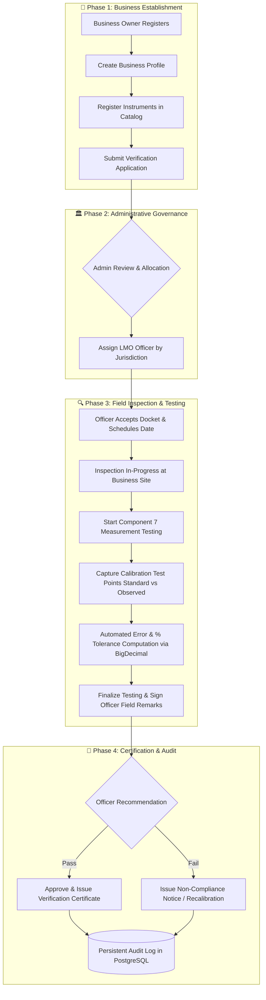
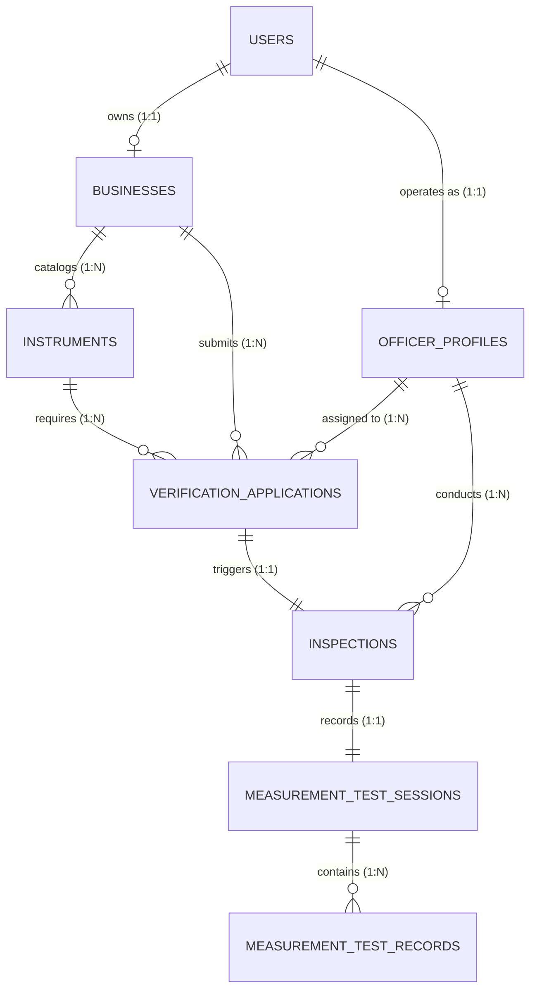

# ⚖️ SCALEGUARD — Digital Legal Metrology Platform

<div align="center">

[](https://www.sih.gov.in/)
[](https://openjdk.org/)
[](https://spring.io/projects/spring-boot)
[](https://www.postgresql.org/)
[](https://react.dev/)
[](https://expo.dev/)
[](https://www.docker.com/)

**Next-Generation Digital Verification, Field Inspection, and Certification Lifecycle Platform for Weighing & Measuring Instruments**

[Architecture](#-system-architecture) • [End-to-End Workflow](#-end-to-end-workflow) • [Components 1–7](#-implemented-modules--components) • [Database & Schema](#-database--persistence-architecture) • [Getting Started](#-getting-started) • [Demonstration Guide](#-hackathon-demo-guide)

</div>

---

## 📌 Executive Summary & Problem Statement

Under the **Legal Metrology Act**, millions of commercial weighing and measuring instruments across India must undergo periodic calibration, physical stamping, and verification. The traditional ecosystem suffers from:
- **Fragmented manual paperwork** and delayed verification dockets.
- **Vulnerability to seal tampering**, calibration drift, and counterfeit verification certificates.
- **Lack of centralized state-wide monitoring** for Legal Metrology Officers (LMOs) and compliance auditors.

**ScaleGuard** unifies the entire Legal Metrology lifecycle into an authoritative, tamper-evident digital platform:
1. **Commercial Businesses:** Register businesses, catalog instrument inventories, submit verification dockets, and track real-time certification statuses.
2. **Legal Metrology Officers (LMO):** Receive geo-jurisdictional inspection dockets, conduct multi-point calibration error tests, record tamper-evident observations, and sync offline/online field logs.
3. **State & Central Administrators:** Oversee statewide equipment compliance, reassign officers dynamically, audit calibration curves, and enforce statutory metrological tolerances.

---

## 🏗️ System Architecture

ScaleGuard is organized as a unified monorepo housing both web governance consoles and offline-first mobile inspection tools:

```
                                  SCALEGUARD MONOREPO
                                           │
         ┌─────────────────────────────────┴─────────────────────────────────┐
         ▼                                                                   ▼
┌─────────────────────────────────┐                         ┌─────────────────────────────────┐
│       ScaleGuard-WebApp         │                         │      ScaleGuard-MobileApp       │
│  (Government Web & Core APIs)   │                         │   (LMO Field Inspection App)    │
└────────────────┬────────────────┘                         └────────────────┬────────────────┘
                 │                                                           │
        ┌────────┴────────┐                                         ┌────────┴────────┐
        ▼                 ▼                                         ▼                 ▼
┌──────────────┐  ┌──────────────┐                          ┌──────────────┐  ┌──────────────┐
│ Spring Boot  │  │  React +     │                          │ React Native │  │  FastAPI AI  │
│ REST API     │  │  Vite Web UI │                          │ Expo Mobile  │  │  Forensics   │
│  (Port 8080) │  │  (Port 5173) │                          │ (Material 3) │  │ (Tamper Det) │
└───────┬──────┘  └──────────────┘                          └──────────────┘  └──────────────┘
        │
        ▼
┌────────────────────────────────────────────────────────┐
│               PERSISTENT DATA PLATFORM                 │
│  ┌────────────────────────┐  ┌──────────────────────┐  │
│  │  PostgreSQL 16 Engine  │  │  pgAdmin 4 Dashboard │  │
│  │      (Port 5432)       │  │     (Port 5050)      │  │
│  └────────────────────────┘  └──────────────────────┘  │
│                   Managed via Docker Compose           │
└────────────────────────────────────────────────────────┘
```

---

## 🔄 End-to-End Workflow

The lifecycle follows a strictly validated, state-machine driven audit trail:



---

## 🧩 Implemented Modules & Components

ScaleGuard has been engineered through rigorous architectural components, with **100% test coverage (81/81 automated tests passing)**:

| Component | Domain | Key Capabilities & Security Controls |
| :---: | :--- | :--- |
| **1** | **Authentication & RBAC** | Stateless JWT authentication, BCrypt encryption (strength 10), role hierarchies (`ADMIN`, `LMO_OFFICER`, `BUSINESS_OWNER`), centralized RFC-compliant exceptions. |
| **2** | **Business Profiles** | Strict 1:1 owner-to-business relation (`owner_id UNIQUE NOT NULL`), conflict checks, GSTIN/registration validation, admin directory. |
| **3** | **Instrument Management** | Equipment cataloging, measurement unit validation, global serial number uniqueness (`409 Conflict`), soft-deactivation protection. |
| **4** | **Verification Dockets** | `DRAFT` ➔ `SUBMITTED` state machine, sequential docket generation (`SG-YYYY-XXXXXX`), immutable upon formal submission, tenant-isolated access. |
| **5** | **Officer Assignment** | Officer profile provisioning with district jurisdictions, dynamic workload allocation & reassignment, officer docket console. |
| **6** | **Inspection Management** | Official inspection numbers (`INSP-YYYY-XXXXXX`), scheduled/in-progress/completed states, mandatory cancellation audits with reason justification. |
| **7** | **Measurement Testing** | Multi-point calibration test sessions, sub-milligram high-precision calculations using `BigDecimal(19, 6)`, automatic Error & Error% evaluation, admin read-only audit logging. |

---

## 🗄️ Database & Persistence Architecture

ScaleGuard uses an enterprise **PostgreSQL 16** relational schema managed by Spring Data JPA and Hibernate with automatic schema migrations.



### Relational Schema Summary:
1. **`users`**: Identity, credentials, contact details, and role clearance (`ADMIN`, `LMO_OFFICER`, `BUSINESS_OWNER`).
2. **`businesses`**: Legal business name, GSTIN, establishment type, physical address, and owner foreign key.
3. **`instruments`**: Instrument type, brand, model, serial number, max capacity, accuracy class, verification interval.
4. **`verification_applications`**: Docket tracking number (`SG-2026-XXXXXX`), status, requested date, assigned officer.
5. **`officer_profiles`**: LMO badge code, official jurisdiction district, contact details, operational status.
6. **`inspections`**: Inspection docket (`INSP-2026-XXXXXX`), scheduled timestamps, field notes, cancellation reasons.
7. **`measurement_test_sessions`**: Calibration session metadata, start/completion timestamps, overall officer remarks.
8. **`measurement_test_records`**: Calibration points, standard weight, observed weight, calculated error, percentage error.

---

## 📂 Monorepo Project Structure

```text
SIH-2K26-main/
│
├── .gitignore                             # Monorepo version control rules
├── README.md                              # Master project architectural documentation
│
├── ScaleGuard-WebApp/                     # Full-Stack Web Platform & Core Services
│   ├── docker-compose.yml                 # PostgreSQL 16 & pgAdmin 4 orchestration
│   ├── test_component2.ps1                # Component 2 automated verification
│   ├── test_component3.ps1                # Component 3 automated verification
│   ├── test_component4.ps1                # Component 4 automated verification
│   ├── test_component5.ps1                # Component 5 automated verification
│   ├── test_component7.ps1                # Component 7 live end-to-end verification
│   │
│   ├── backend/                           # Spring Boot 3.3.4 (Java 21) REST API
│   │   ├── pom.xml                        # Maven dependencies (PostgreSQL, JJWT, JPA)
│   │   └── src/
│   │       ├── main/java/com/scaleguard/
│   │       │   ├── config/                # Security, CORS, DataInitializer
│   │       │   ├── controller/            # Role-partitioned REST Controllers
│   │       │   ├── dto/                   # Request, Response, and Summary DTOs
│   │       │   ├── entity/                # Relational JPA Entities
│   │       │   ├── repository/            # Spring Data Repositories & Specifications
│   │       │   ├── security/              # JWT Filters, UserDetails, Handlers
│   │       │   └── service/               # Business logic & tolerance calculations
│   │       └── test/java/com/scaleguard/  # 81 Integration & Unit Test Suites
│   │
│   └── web/                               # React 18 + Vite 5 Frontend Web Portal
│       ├── package.json                   # Dependencies (Tailwind, Lucide, Axios)
│       ├── vite.config.js                 # Dev server & reverse proxy configuration
│       ├── tailwind.config.js             # Official Gov-Tech design token system
│       └── src/
│           ├── components/                # Modular UI widgets, badges, modals, tables
│           ├── context/                   # AuthContext with JWT session recovery
│           ├── pages/                     # Admin, Officer, and Business Owner views
│           ├── routes/                    # ProtectedRoute with RBAC guards
│           └── services/                  # Axios API communication layer
│
└── ScaleGuard-MobileApp/                  # Offline-First LMO Field Application
    ├── App.tsx                            # React Native entry point
    ├── app.json                           # Expo configuration (SDK 57)
    ├── package.json                       # React Native 0.86, SQLite, Camera
    ├── src/
    │   ├── core/                          # SQLite Database, Network, Theme
    │   ├── features/                      # 5-Step Inspection Wizard & AI Verification
    │   └── shared/                        # Reusable Material 3 components
    └── ai-service/                        # Python microservice for seal tamper detection
```

---

## 🚀 Getting Started

### Prerequisites
- **Java 21 JDK** (e.g. OpenJDK 21)
- **Node.js** (v18 or higher) & **npm**
- **Docker Desktop** (for PostgreSQL + pgAdmin)
- **Git**

---

### Step 1: Start the Persistent Database (PostgreSQL + pgAdmin)

Run the included Docker Compose configuration:

```powershell
cd ScaleGuard-WebApp
docker compose up -d
```

- **PostgreSQL 16 Engine:** Running on `localhost:5432` (`database: scaleguard`, `user: postgres`, `password: postgres`)
- **pgAdmin 4 Visual Tool:** Open **[http://localhost:5050](http://localhost:5050)** in your browser:
  - *Login Email:* `admin@scaleguard.com`
  - *Password:* `Admin@123`

---

### Step 2: Launch the Spring Boot Backend

```powershell
cd ScaleGuard-WebApp/backend
mvn spring-boot:run
```
*The backend connects to PostgreSQL automatically, synchronizes all 8 JPA tables, and bootstraps default development accounts.*
- **API Base URL:** `http://localhost:8080/api`

---

### Step 3: Launch the React Web Dashboard

```powershell
cd ScaleGuard-WebApp/web
npm install
npm run dev -- --host
```

- **Web Application Portal:** **[http://localhost:5173](http://localhost:5173)**
- **LAN Access (Mobile/Tablets):** Available on your local Wi-Fi IP address printed in the terminal.

---

### Step 4 (Optional): Launch the LMO Field Mobile App

```powershell
cd ScaleGuard-MobileApp
npm install
npx expo start
```
*Scan the generated QR code using the **Expo Go** mobile app on Android or iOS.*

---

## 🔑 Default Development Credentials

Pre-seeded credentials for immediate evaluation and testing:

| Role | Email Address | Password | Allowed Dashboards & Portals |
| :--- | :--- | :--- | :--- |
| **System Administrator** | `admin@scaleguard.com` | `Admin@123` | `/dashboard/admin`, Businesses, Instruments, Applications, Officer Allocation, Inspection Audit |
| **LMO Inspection Officer** | `officer@scaleguard.com` | `Officer@123` | `/dashboard/officer`, Assigned Dockets, Inspection Details, Measurement Testing Module |
| **Business Owner** | *Self-Register at `/register`* | *Custom* | `/dashboard/business-owner`, Business Profile, Instrument Registration, Docket Submission |

> 💡 *Quick Test: On the web login screen ([http://localhost:5173/login](http://localhost:5173/login)), click the **"🔑 Admin"** or **"📱 LMO Officer"** quick-fill buttons to populate credentials automatically.*

---

## 🧪 Automated Testing & Verification

ScaleGuard features a robust automated test harness:

### 1. Spring Boot Integration Tests
Runs the full suite of **81 automated integration tests** covering security, RBAC, exceptions, and lifecycle logic:
```powershell
cd ScaleGuard-WebApp/backend
mvn test
```
*Result: `Tests run: 81, Failures: 0, Errors: 0, Skipped: 0`*

### 2. Live End-to-End PowerShell Suite
Runs end-to-end multi-role verification against the live server:
```powershell
cd ScaleGuard-WebApp
powershell -ExecutionPolicy Bypass -File .\test_component7.ps1
```

---

## 🏆 Hackathon Demonstration Guide (For Judges)

1. **Enterprise Data Architecture:**
   - Open **pgAdmin 4** at [http://localhost:5050](http://localhost:5050).
   - Expand `ScaleGuard Postgres` ➔ `Databases` ➔ `scaleguard` ➔ `Tables`.
   - Show judges the clean relational structure, foreign keys, and encrypted passwords in `users`.

2. **Commercial Business Owner Journey:**
   - Open [http://localhost:5173](http://localhost:5173) and register a new business.
   - Add a commercial weighing instrument (e.g. Weighbridge, 50000 kg, Class III).
   - Create and submit a formal verification docket (`SG-2026-XXXXXX`).

3. **Government Administrator Workflow:**
   - Log in as **Administrator** (`admin@scaleguard.com`).
   - Locate the submitted docket and allocate it to an active Legal Metrology Officer.

4. **Field Officer Inspection & Precision Testing:**
   - Log in as **Officer** (`officer@scaleguard.com`).
   - Accept the docket, start the inspection, and initiate **Measurement Testing**.
   - Input test weights (e.g. 10.0 kg Standard vs 10.02 kg Observed).
   - Demonstrate the sub-milligram precision engine calculating Error and Percentage Error in real-time.
   - Complete the session and review the final inspection summary.

5. **Live Relational Audit:**
   - Refresh pgAdmin 4 in front of the judges to show the new rows immediately saved in `inspections` and `measurement_test_records`.
   - Restart the backend to show 100% persistence!

---

## 🛡️ License

Developed by **Team Elite Architects** for the **Smart India Hackathon (SIH 2026)**.
All rights reserved.
